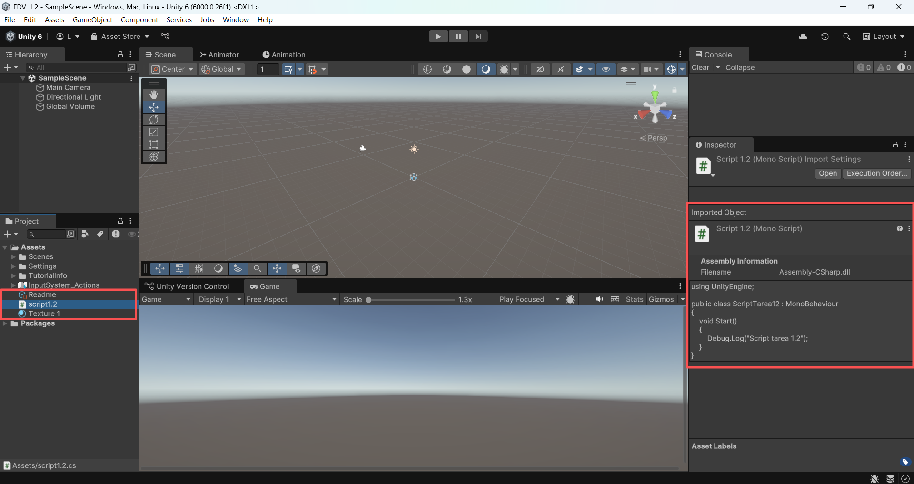
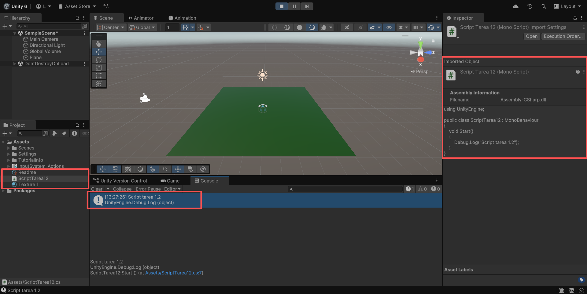
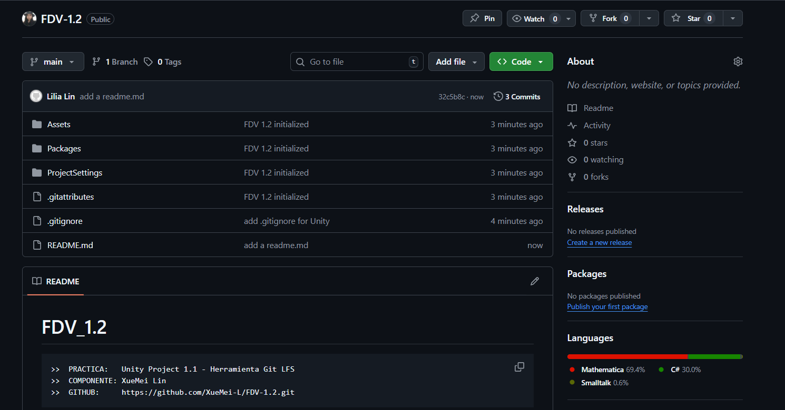

FDV_1.1_Herramienta.Git LFS

```
>> PRACTICA:   Unity Project 1.1 - Herramienta Git LFS
>> COMPONENTE: XueMei Lin
>> GITHUB:     https://github.com/XueMei-L/FDV_1.1.git
>> Versión:    1.0.0
```

## Proceso de la practica 1.1
### 1. crea un repositorio nuevo para la tarea 1.2


### 2. Configurar el fichero .gitattributes adecuadamente


### 3. Guarda el archivo y añádelo al repositorio (FDV_1.2)
    ```
    git init
    
    # Instala Git LFS
    git lfs install

    git add
    
    git commit -m "Init project 1.2"
    ```

### 4. agrear una textura y un **ScriptTarea12.cs**

4.1. agregar una textura llamado "texture1"


4.2. crear un script

**ScriptTarea12.cs: **

```
using UnityEngine;

public class ScriptTarea12 : MonoBehaviour
{
    void Start()
    {
        Debug.Log("Script tarea 1.2");
    }
}
```


### 5. realiza los siguientes comandos con git LFS:
```
git lfs track "*.png" "*.jpg" "*.tif" "*.tga"
```
```
git lfs track "ScriptTarea12.cs"
```

### 6. subir al github FDV1.2
```
git branch -M main
git remote add origin https://github.com/XueMei-L/FDV-1.2.git

```


Enlace del repo FDV1.2:
https://github.com/XueMei-L/FDV-1.2.git
